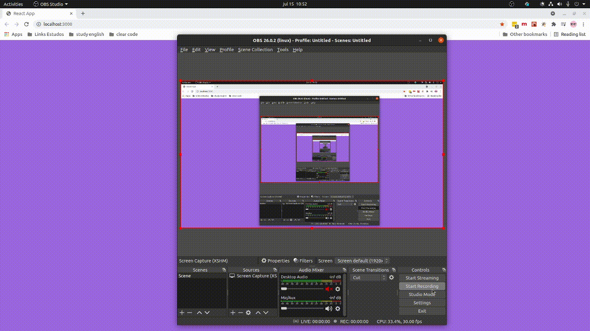

## Executar projeto

```shell
  yarn
  yarn start

```

## O que foi desenvolvido? 
Sistema de geerenciamento de estabelecimento simples



Abrir [Figma](https://www.figma.com/file/EY2QgOxAEQBPQr54CUnIqc/Desafio-Vai-bem?node-id=1%3A53) para visualizar o esboço do desenho 

- Primeiros passos:
  1. Tela de login (email e senha)
  2. Permitir adicionar estabelecimento / remover
  3. Tela para gerenciar estabelecimento
  4. Cadastro usuário (nome, email e senha) 

1 - Login (email e senha)
  limitação: 
    1. Sem autenticação
    2. Dados mock
2 - Tela para adicionar estabelecimento
  limitação: 
    1. Apenas lista os estabelecimentos
    2. Sem roteamento para páginas
3 - passo 3 e 4 
    1. Não consegui desenvolver a tempo

Melhorias: 
  1. Refatoramento do código, extrair componentes das pages
  2. Adicionar novas telas como Gerenciar Estabelecimento
  3. Adicionar roteamento no react para acessar telas de registro e outras telas

Limitação no desenvolvimento:
  1. Tempo para desenvolver

Explicação breve:
  1. Routes: apenas consigo acessar as routes se estiver logado
  2. Pages: páginas criadas 
  3. Contexts: gerenciadores de estado da aaplicação 
  4. Components: componentes extraídos das pages
  5. Services: conexão com a api
